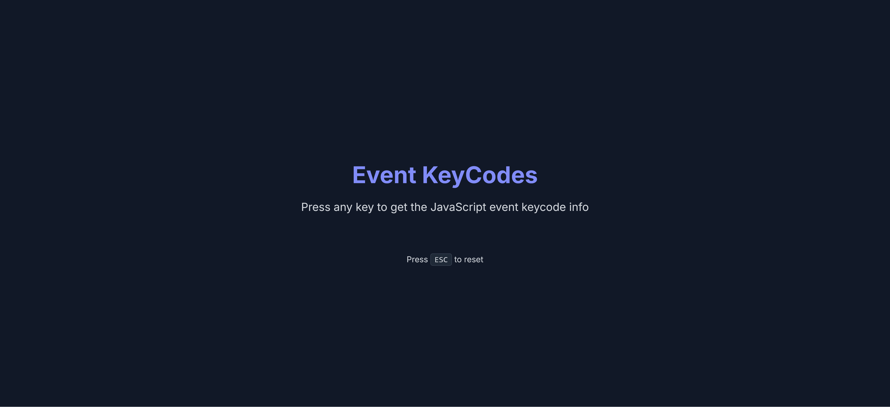
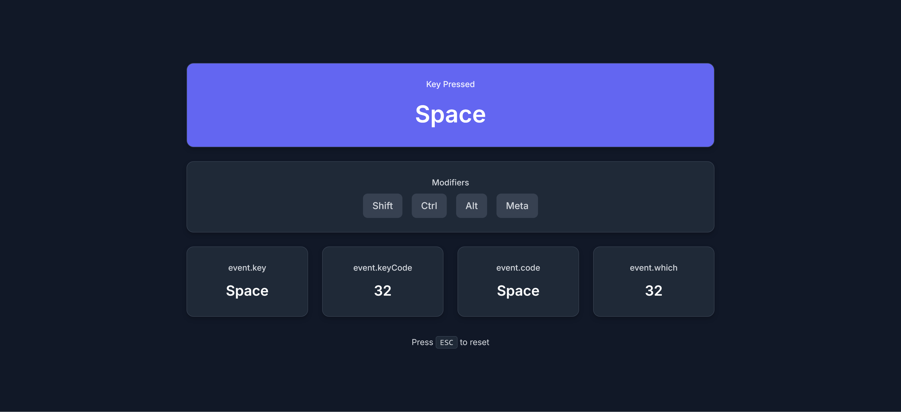
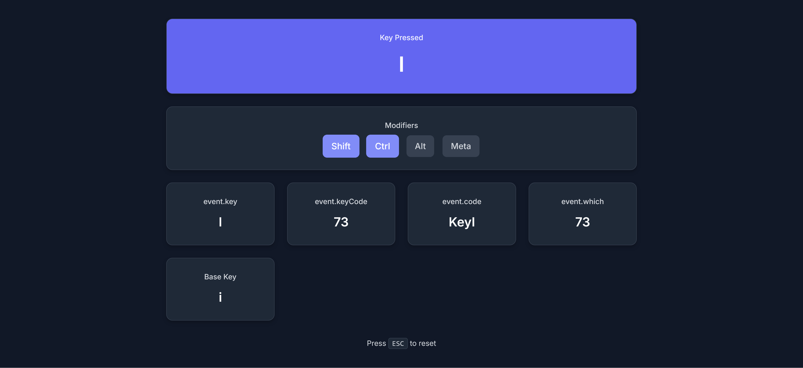

# ⌨️ **Event Keycodes** ⌨️

Welcome to the **Event Keycodes** project! This interactive web application allows you to explore and display the details of the keys you press on your keyboard. Whether you're interested in `keycode`, `key`, `event.code`, or special characters, this app will show it all in real-time! ⌨️

## 🌟 **Features** 🌟

- **Press any key** to get instant information about the key you pressed.
- **Modifier keys** like Shift, Ctrl, Alt, and Meta are displayed when active.
- See different key properties:
  - `event.key`: The value of the key pressed.
  - `event.keyCode`: The key code associated with the key.
  - `event.code`: The physical key pressed (like "KeyA").
  - `event.which`: A similar event property to `keyCode` for compatibility.
- Special handling for **shifted characters** like `@`, `!`, and `$`.

## ⚙️ **How to Use** ⚙️

1. Clone this repository or download the files.
2. Open the `index.html` file in your browser.
3. Press any key on your keyboard to view its information. 🖱️
4. **Press the Escape key** to reset the app and start over. 🆗

## 📝 **Technologies Used** 📝

- **HTML**
- **CSS**
- **JavaScript**

## 💡 **How It Works** 💡

- When a key is pressed, the JavaScript listens for the `keydown` event.
- The app dynamically updates the key information displayed on the screen, including the key pressed, key code, and modifier keys.
- It also handles special characters that appear when the Shift key is used.

## 🔄 **Reset the App** 🔄

If you'd like to start over, simply press the **Escape (ESC)** key. This will reset all the displayed information and bring back the initial instructions. ⏪

## Preview

Here is a preview of the app:

---

Enjoy exploring the world of keycodes! 🎉👩‍💻👨‍💻

---
